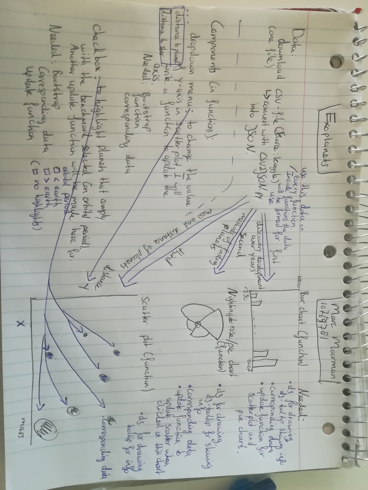

# Design Document  

- Data source  
My one data source is Kaggle (https://www.kaggle.com/eduardowoj/exoplanets-database/data). I will download a csv-file here and use my CSV2JSON.py to convert the csv-file into a json file. I will transform my data in such a way that data for corresponding years is in one list per topic. So amount of planets discovered per year, the methods used, distance etc. I will do this by initializing an empty list every time so I will not end up with over 20 filled lists. I will filter the data on missing data as well.  

- Technical components  
As mentioned before I will use my own CSV2JSON.py (csv to json) converter to make my data usable. Furthermore I will create a scatter plot, a bar chart and a pie chart (or something similar like a Radial Column chart or a Nightingale Rose chart).  
    
	All my graphs will be given the entire dataset to filter out the specific data needed. They all will use d3 and the d3-tip as well. Besides the functions for the bar - and Nightingale Rose chart will also need to be given the data needed for the scatter plot because out of these charts the scatter plot will be updated by clicking on parts of the graph.  
  
	For my components I have chosen a dropdown menu and a checkbox. The dropdown menu will change the y-axis of my scatter plot from distance to the planet to the distance to the star of that planet. My checkbox will adjust the highlighted planets in my scatter plot. With as benchmark the orbital period of our earth.  

	For every graph I will make a seperate function. So makePiechart(data), makeScatterplot(data) etc.. Furthermore, due to my dropdown menu that will update my y-axis I am thinking about creating two different functions to draw my bar chart. One function to draw te axis and one function to draw the bars. This way it will become easier to update the axis with just one function. I will also make an update function per chart, since all of them can be updated out of either the checkboxes, pie chart or bar chart. The update functions will just take data for that corresponding year/topic and input that data into the original draw function for that chart. All the functions will be exercised after the page is fully loaded using the window.onload() function. 

- My plug-ins are d3, d3-tip and bootstrap.  

