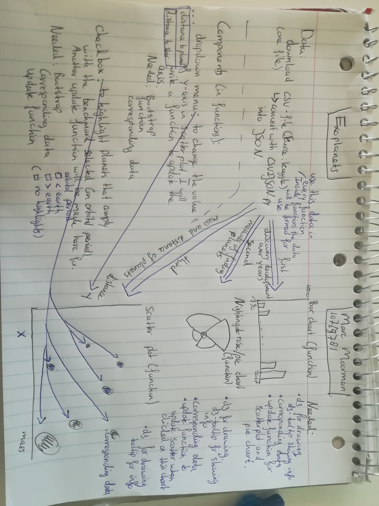

# Design Document  

Seperate data management and user interface

- My one data source is Kaggle (https://www.kaggle.com/eduardowoj/exoplanets-database/data ). I will download a csv-file here and use my CSV2JSON.py to convert the csv-file into a json file. I will transform my data in such a way that data for corresponding years is in one list per topic. So amount of planets discovered per year, the methods used, distance etc. I will do this by initializing an empty list everytime so I will not end up with over 20 lists. I will filter the data on missing data as well.  

- Technical components  
As mentioned before I will use my own CSV2JSON.py (csv to json) converter to make my data usable. Furthermore I will create a scatterplot, a barchart and a pie chart (or something similar like a Radial Column chart or a Nightingale Rose chart).  
    
All my graphs will be given the entire dataset to filter out the specific data needed. They all will use d3 and the d3-tip as well. Besides the functions for the bar and nightingale-rose chart will also need to be given the data needed for the scatterplot because out of these charts the scatterplot will be updated by clicking on parts of the graph.  
  
For my components I have chosen a dropwdown menu and a checkbox. The dropdown menu will change the y-axis of my scatter plot from distance to the planet to the distance to the star of that planet. My checkbox will adjust the highlighted planets in my scatter plot. With as benchmark the orbital period of our earth.  

- My plugins are d3, d3-tip and bootstrap.  