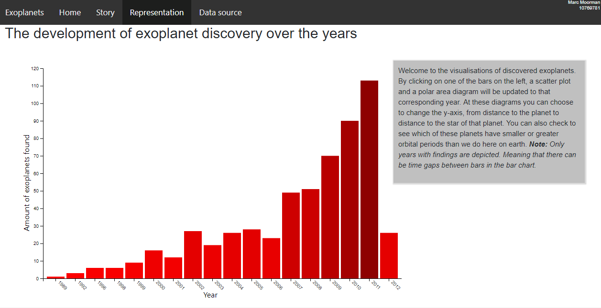
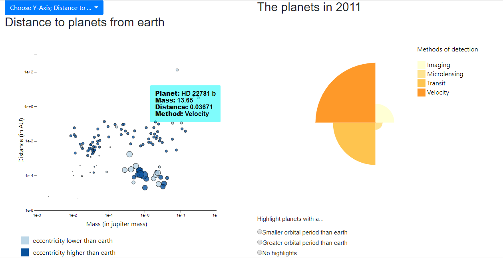
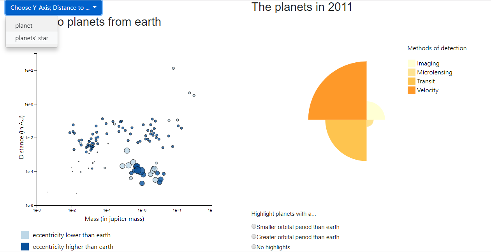
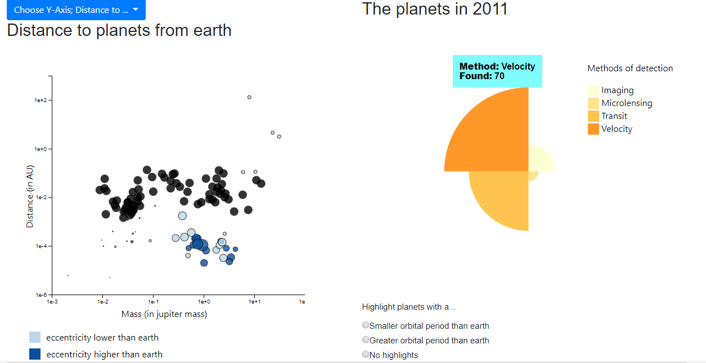

# Final project on Exoplanets  

"A look into space"  

COUPLE OF SCREENSHOTS  

First view of the visualizations

**Purpose**
The purpose of these visualizations is to give an easy look into the planets we have discovered over the years. Some characteristics of the planets will be visualized together with the method of detection.  It is meant for everyone with an interest in outer space, no prior knowledge is needed.  

Marc Moorman  
10769781  
<a href="https://marcmrman.github.io/final_project/">My pages</a>  

Copyright (c) 2018 MarcMrman

Permission is hereby granted, free of charge, to any person obtaining a copy
of this software and associated documentation files (the "Software"), to deal
in the Software without restriction, including without limitation the rights
to use, copy, modify, merge, publish, distribute, sublicense, and/or sell
copies of the Software, and to permit persons to whom the Software is
furnished to do so, subject to the following conditions:

The above copyright notice and this permission notice shall be included in all
copies or substantial portions of the Software.

THE SOFTWARE IS PROVIDED "AS IS", WITHOUT WARRANTY OF ANY KIND, EXPRESS OR
IMPLIED, INCLUDING BUT NOT LIMITED TO THE WARRANTIES OF MERCHANTABILITY,
FITNESS FOR A PARTICULAR PURPOSE AND NONINFRINGEMENT. IN NO EVENT SHALL THE
AUTHORS OR COPYRIGHT HOLDERS BE LIABLE FOR ANY CLAIM, DAMAGES OR OTHER
LIABILITY, WHETHER IN AN ACTION OF CONTRACT, TORT OR OTHERWISE, ARISING FROM,
OUT OF OR IN CONNECTION WITH THE SOFTWARE OR THE USE OR OTHER DEALINGS IN THE
SOFTWARE.  

**External code sources:**  
- Polar Area Diagram: https://bl.ocks.org/curran/94f1376b946c9d217014 , the code for the polar area diagram has no license.  
- Scatter plot and bar chart: http://alignedleft.com/tutorials/d3 ,this tutorial has a copyright.  
- Radio buttons: https://www.w3schools.com/bootstrap/bootstrap_forms_inputs.asp , We3schools has his own copyright license.  
- Dropwdown menu: https://www.w3schools.com/howto/howto_js_dropdown.asp , We3schools has his own copyright license.  
- Navigation bar: https://www.w3schools.com/bootstrap/bootstrap_navbar.asp , We3schools has his own copyright license.  

**External sources besides code:**
- Shortcus image: https://phys.org/news/2014-12-percent-earth.html ,the source allows students to use their website for their own work without permission.  
- Data:  https://www.kaggle.com/eduardowoj/exoplanets-database/data , CC0 1.0 Universal license, work is dedicated to public domain.  
- Story telling knowledge: https://en.wikipedia.org/wiki/Methods_of_detecting_exoplanets#Transit_timing