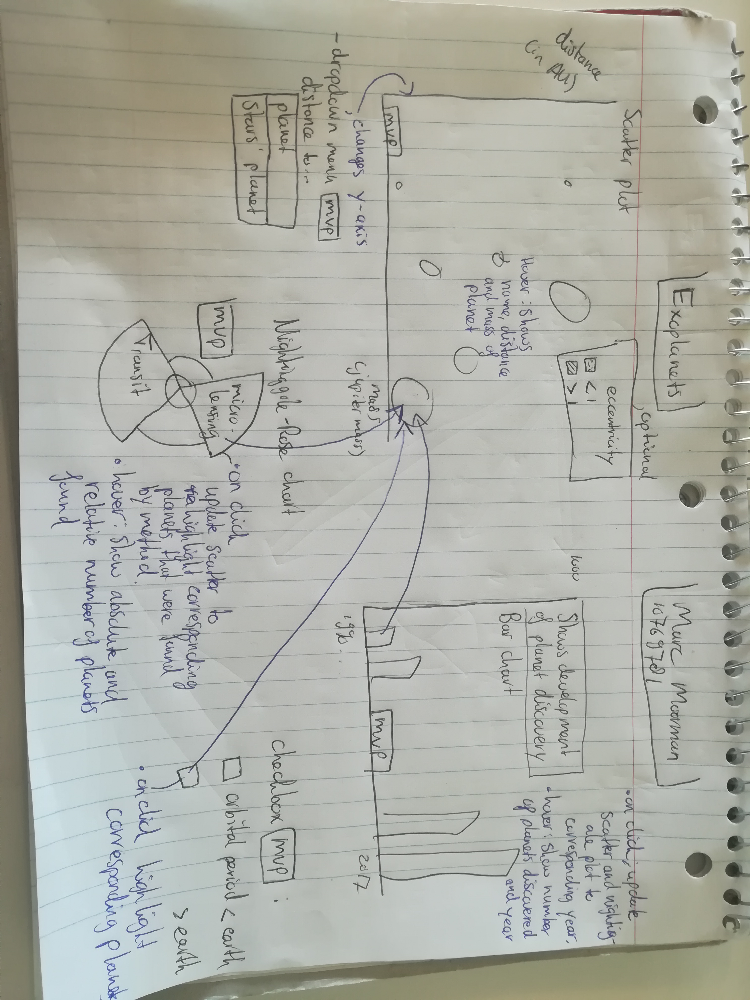

# Final project on Exoplanets  

Marc Moorman  
10769781  
<a href="https://marcmrman.github.io/final_project/">My pages</a>

**Summary**  
This webpage is a visualization on characteristics of exoplanets found in the last couple of decades. It is meant to inform people on methods of discovery and planet specific characteristics per year. 

**Problem**  
Space is a difficult concept. On our search to a new habitable planet a lot of other planets have been found, together with their sun. Because this is not an everyday topic, this visualization will depict planets discovered, together with other characteristics. This visualization is meant for people with an interest in space discovery.  

**Solution**  
This visualization gives an easy and quick view on our discoveries on planets in space.  

**Main features:**  
- Scatter plot (MVP): This plot will display the mass and distance of the planet. Distance can be chosen to the planet itself or its sun through a dropdown menu. You can hover over the planets, this will show the name, mass and relevant distance of that specific planet. Optional: Coloring the planets depending on their eccentricity (how round a planet is).  
- Bar chart (MVP): This chart shows the development of planet discovery over time. When hovering over a bar, the year and the number of planets discovered will be told. When clicked on a bar, the Nightingale-Rose chart and the scatter plot will be updated to the according year.  
- Nightingale-Rose chart (MVP): The Nightingale-Rose chart gives a view on the methods used to discover the planets. When hovering over a part in the chart the absolute number and the percentage of the total planets found with the method will be displayed. When clicked/hovered on a part of the Nightingale-Rose chart the planets that are found with the according method will be highlighted in the scatter plot.  

**Interactive components:**    
- Dropdown menu (MVP): Here the y-axis of the scatter plot can be chosen. The choices are between distance to the planet and distance to the star of the planet from earth measured.  
- Checkbox (MVP): Here a selection can be made. The choices are about if the orbit of the planet is longer/shorter than earths' is.  

### Prerequisites  
The folder "doc" contains pictures of my visualization.  
- Data source: https://www.kaggle.com/eduardowoj/exoplanets-database/data  
- External components: d3, d3-tip  
- Similar visualizations:  http://exoplanets.tommykrueger.com/app/, this visualization is close to what I'm making (in the sense of information shown). Here they have a drag able map of the universe. My visualization will be easier to read and more directed to beginners/people who want a quick view on the solar systems. Without having to scroll. Also, this visualization might be a bit out of reach for me.  https://public.tableau.com/en-us/s/gallery/weekly-news-iron-viz-2015-champion this visualization has the same kind of layout. Using a bar chart (with dates) as updater for the rest of the visualizations. That is relevant for me as well because that is the goal of my visualization.  
- Though parts: The checkbox is new so can get difficult. I need to make a good update function. So updating without removing old svg's.  