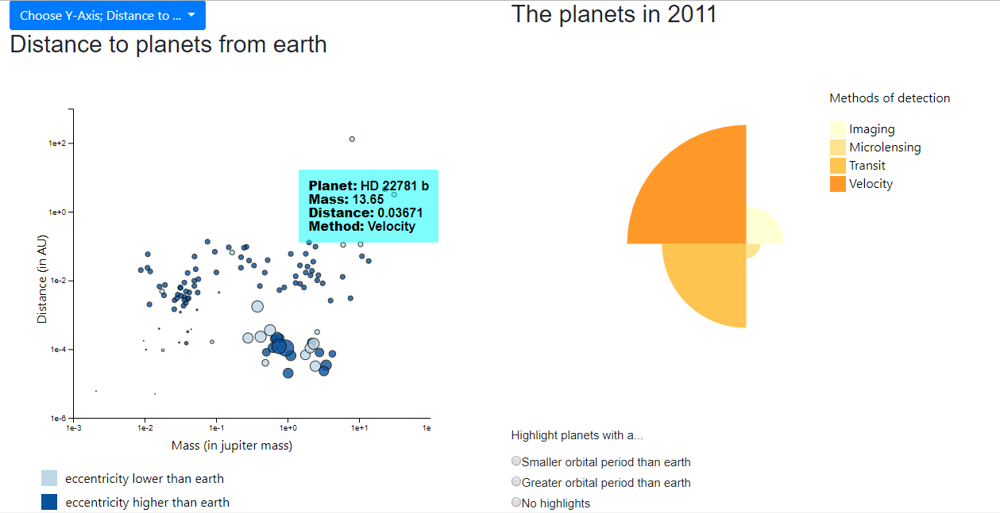

## Description  
These visualizations will give an insight in the exoplanets we have found over the years. Displaying progress over the years, methods and planet specifc charactersitics.  

  

## Technical Design  
This project consists of three html pages. One homepage, one story page and one page for the visualizations. These pages are linked throug a navigation bar, which also contains a link to the dataset source. If clicked the data source is clicked a new tab will be opened and you will be directed to the source.  

The visualizations page has three graphs. A bar chart, a scatter plot and a polar area diagram. Each graph has its own file to retrieve the needed data, draw the graph and if needed draw a legend. The functions in these files get called in a start javascript file called exoplanets.js. In this file I also made my data a global variable, making it accesible in every function in every file. The data is downloaded as a CSV file and converted to JSON using convertCSV2JSON.py in scripts. The folder scripts also holds the d3 library. Other used libraries (included using links) are bootstrap, jQuery and ajax.  

- drawBarChart.js contains all needed steps to draw the bar chart. It has two functions, one for retrieving needed data and one to draw the bar chart and its functionalities. The bar chart shows the amount of discoveries per year. Before this, all data is filtered on completeness of the observation. So registrations without information like mass or distance has been deleted upfront. To find all findings per year in getBarData() all observations' years are put into a list and sorted from low to high. Then the duplicates are counted and put into a seperate list. These lists are returned to drawBarChart(). Using d3 the bar chart gets drawn. In drawBarChart() a click function is implemented to update the scatter plot and polar area diagram to the year which is clicked on. These graphs are not updated using seperate update functions as described in the design document. When clicked on a bar, a global variable is given a value (of the year clicked on) and both graphs get removed and drawn again, according to the year that is clicked on.  
- drawScatterPlot.js is used to draw the scatter plot, get the needed data, update its own y-axis and highlight the planets if clicked on a checkbox. As mentioned before, the scatter plot itself get updated by the bar chart with a click function. getScatterData() fetches all data to the year clicked on in the bar chart and returns it to drawScatterPlot(). Then, according to which y-axis topic is selected (planets is the initial topic) it draws the graph with corresponding domain and variables. Both axis of the scatter plot are drawn on a logarithmic scale to correct for outliers. The dropdown menu influences the y-axis of this plot. When one is selected, it changes the global variable topic, removes the graph and draws it again using the selected topic and year. Highligting of the planets is done in the same way. The global variable highlight gets set, the svg gets removed and the scatter plot is drawn again with the correct stroke width for the planets that need to be highlighted. At last addLegend() is performed to append a legend to the graph. All checkox and dropdown menu clicks have their own functions. 

- drawAreaPolarDiagram.js. getAreaDiagramData() retrieves the needed data for the polar area diagram. The method is similar to getBarData(). I give a year to the get data function and let it select all methods that are present. I put them in a list and sort them to make it easier to count all the duplicates. This function returns two lists, one with numbers and one with the detection methods. By sorting I have made sure that the number of on index 0 in the one list corresponds to the methods on index 0 of the other list. This diagram is connected with the scatter plot as well as it highlights the planets to the corresponding detection methods when hovered over. 

## Challenges  
- One of my challenges was to keep track of the topic chosen in the dropdown menu for the y-axis of my scatter plot. I first wanted to declare a variable that was defined by a getElementByID onclick html function, however I already had one on the same ID so that was not possible. To fix this I made a global variable, var topic, to keep track of it. This variable got defined by a function that was activated when a button was pressed. I used this same technique for my checkboxes.  
- My polar area diagram highlight planets when hovered over a detection method. However, on mouseleave it gave the scatter the wrong characteristics back, giving it the wrong colors and sizes. Because what it did was just iterate over the planets of that year and take the first couple that was needed. I fixed this by filling an empty list with the planets that are hovered over, so on mouseleave this list would get iterated over again, in the right order. 

## Defense  
- I have created several global variables. I have done this partly because of the update functions(as mentioned below) did not work as I wanted them to. Also, my code looks way more clean now. First I had to forward data, topic and other such variables to every function. Creating functions that needed parameters that were declared elsewhere and unable to be used in a certain file/function. By creating global variables there was no need for parameters and variables could be used everywhere. Making it easier to make functions and there was no more need to keep defining variables differently in different functions because the variables were global and could be updated more easily. Example: function planetAxis(). First I had to forward data, the svg, the year, the highlight and after this I had to declare the new topic for y-axis. This data also had to be known in my HTML files because I created the function there. Now with the global variable I only had to declare the y-axis topic because all the global variables kept track of the other important variables.  
- I update my graphs by removing SVG's, not by removing just the scatters for example. First it did not work due to all the parameters I had to forward, like topic, data, highlight and such. But after I made global variables I still decided to keep removing my SVG's. I did this because for me it was too difficult to combine all my interactive element. I had to highlight from the checkboxes, update the y-axis from the dropdown and highlight planets when hovered over the polar area diagram. This were too many elements that influenced one graph to make smooth transitions and updates. With more time however, I would have tried to fix it more subtle than by just removing svg's. Also, if the graphs are updated from a bar chart click these graphs are not shown yet, so it is not able to see the transition/update. 